## ПР7

- /api/auth/register (POST)
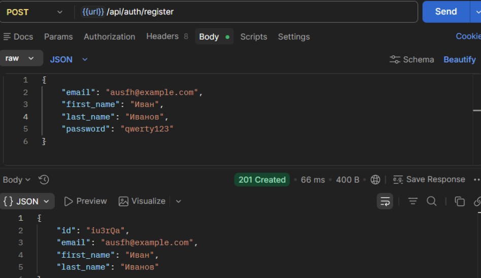

- /api/auth/login (POST)
  

- /api/products (POST)
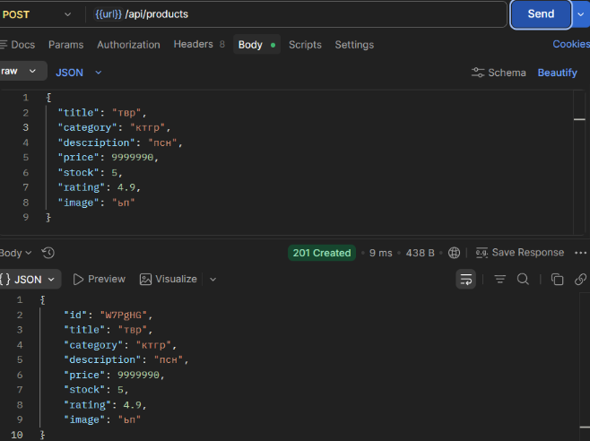
- /api/products (GET)
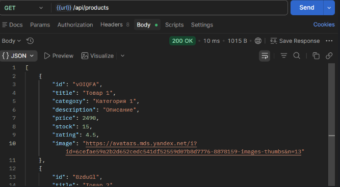
- /api/products/:id (GET)
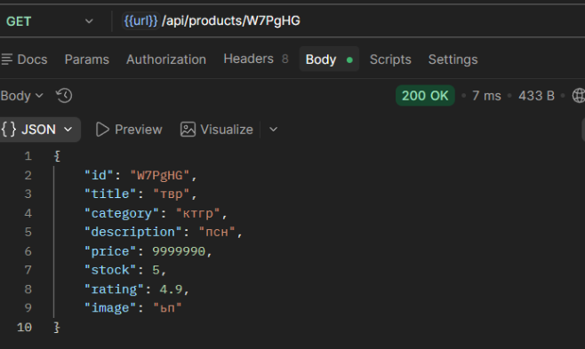
- /api/products/:id (PUT)
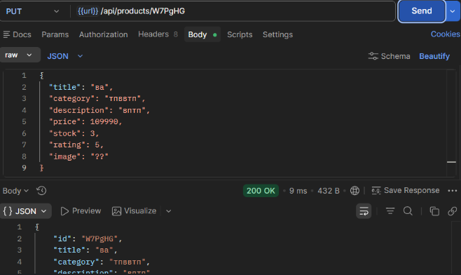
- /api/products/:id (DELETE)

## ПР8

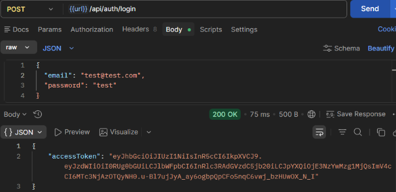

- GET /api/auth/me

## ПР9

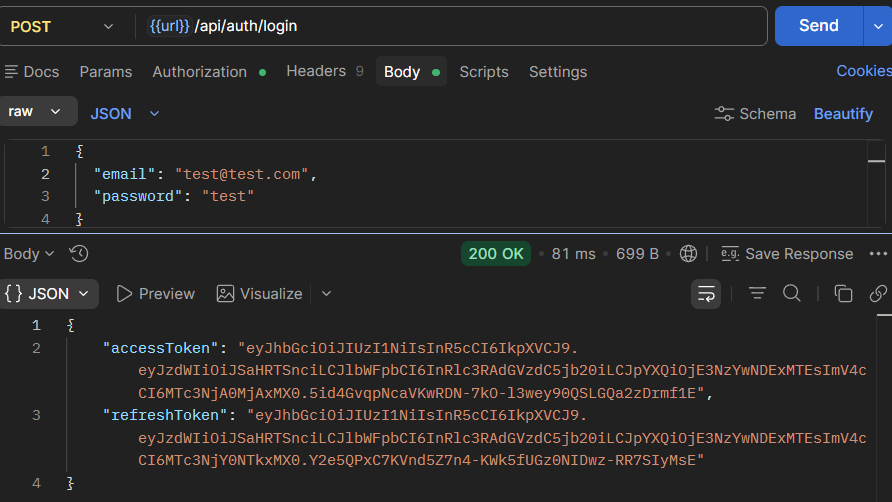

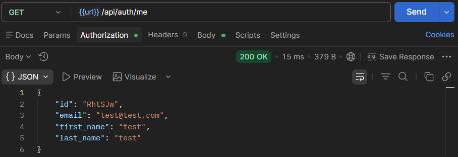

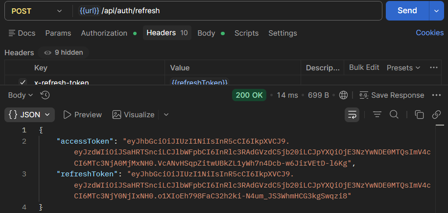

## ПР10

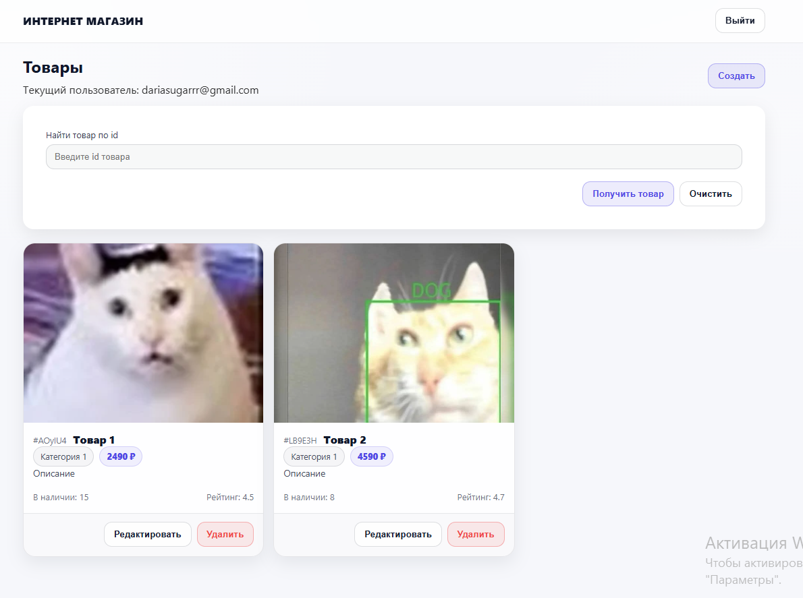

## ПР11

- Пользователь пыьается создать товар
  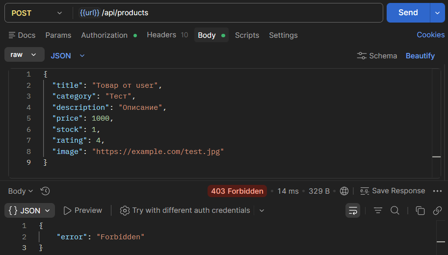
- Админ создает товар
  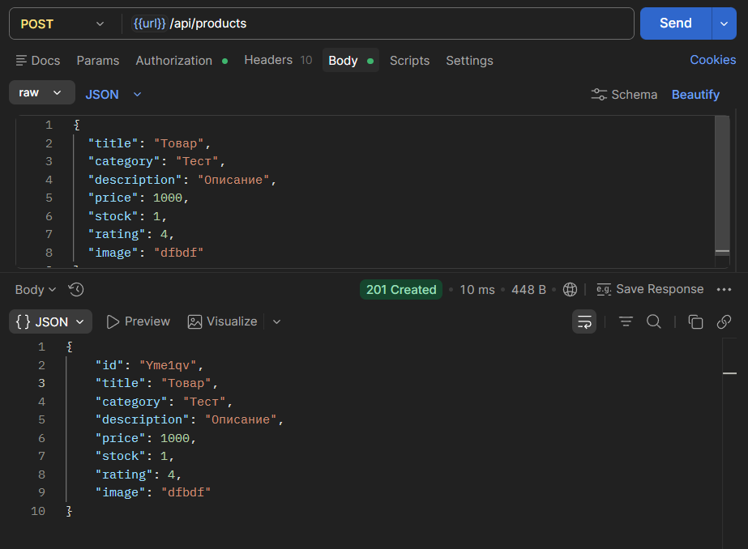

  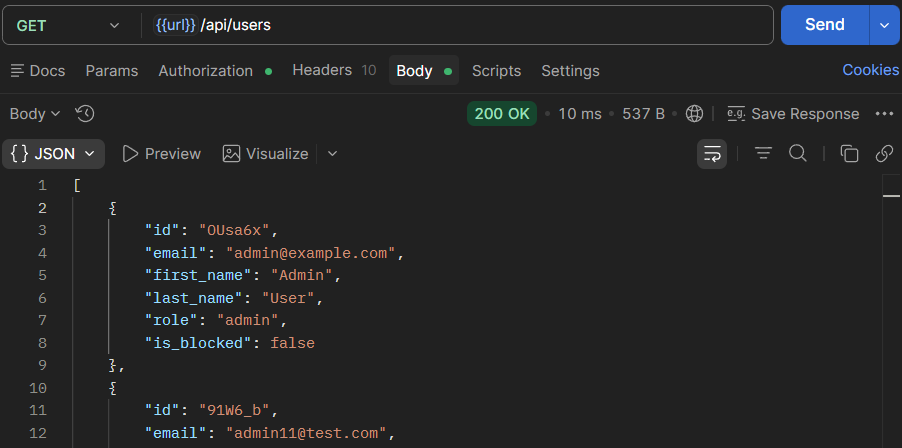